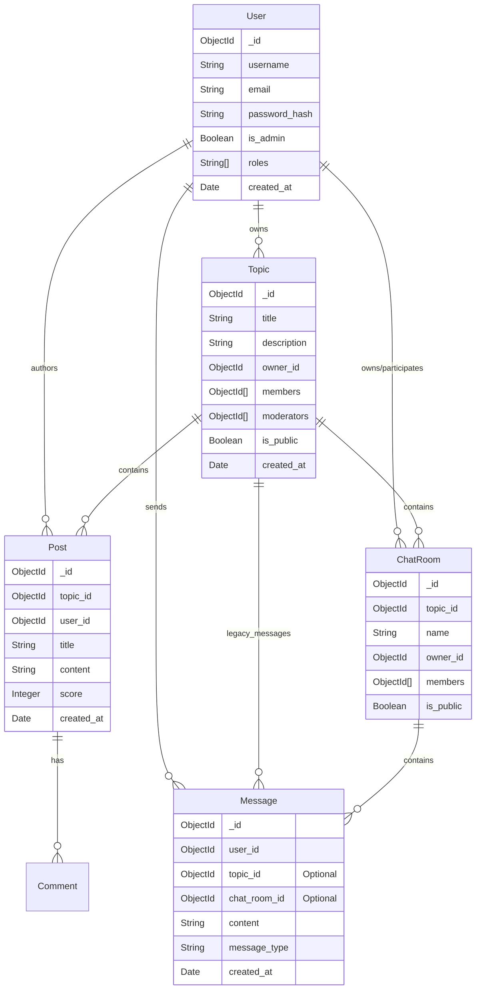

# Database Schema

TopicsFlow uses **MongoDB** (or Azure CosmosDB for MongoDB) as its primary data store. The schema is flexible but follows a structured design enforced by the application's Model layer.

## 📊 Entity-Relationship Diagram

## 🗃️ Collections Detail

### `users`
Stores user account information, authentication details, and profile settings.
- **Indexes**: `username` (unique), `email` (unique).

### `topics`
Represents the main discussion areas (communities).
- **Key Fields**:
  - `owner_id`: Reference to the creator `users._id`.
  - `members`: Array of User IDs who have joined.
  - `moderators`: Array of User IDs with moderation rights.
  - `settings`: Object containing topic-specific configs (e.g., `allow_anonymous`).

### `posts`
Threaded content within a Topic (Reddit-style).
- **Key Fields**:
  - `upvotes` / `downvotes`: Arrays of User IDs for scoring.
  - `score`: Cached calculated score.
  - `anonymous_identity`: String name if posted anonymously.

### `chat_rooms`
Real-time chat channels. Can be standalone (Group Chats) or attached to a Topic.
- **Key Fields**:
  - `topic_id`: Reference to parent Topic (null for ad-hoc groups).
  - `voip_enabled`: Boolean flag for voice/video support.

### `messages`
Individual chat messages. Used in Topics (legacy), Chat Rooms, and Private Messages.
- **Key Fields**:
  - `message_type`: `text`, `image`, `video`, `gif`, `system`.
  - `attachments`: Array of file metadata.
  - `mentions`: Array of User IDs mentioned in the text.

### `private_messages`
Direct messages between two users.
- **Key Fields**:
  - `from_user_id`
  - `to_user_id`
  - `read_at`: Timestamp when read.

### `notifications`
System and user activity notifications.
- **Key Fields**:
  - `user_id`: Recipient.
  - `type`: `mention`, `reply`, `system`, etc.
  - `is_read`: Boolean status.

### `reports`
Content moderation reports filed by users.
- **Key Fields**:
  - `reported_by`: User ID of reporter.
  - `content_type`: `message`, `post`, `user`.
  - `content_id`: ID of the reported item.
  - `status`: `pending`, `resolved`, `dismissed`.

### `tickets`
Support tickets for user inquiries.
