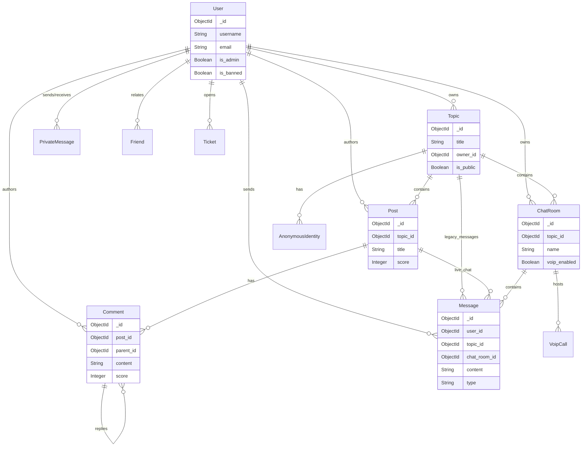

# Database Schema

TopicsFlow uses **MongoDB** (or Azure CosmosDB for MongoDB) as its primary data store. The database is designed with a flexible schema that allows for rapid iteration while maintaining data integrity through the application layer (ODM).

## 📊 Entity-Relationship Diagram

## 🗃️ Collections Reference

| Collection | Description |
|---|---|
| [**users**](#users) | Core user accounts, auth, and profile data. |
| [**topics**](#topics) | Main communities/categories. |
| [**posts**](#posts) | Reddit-style threads within topics. |
| [**comments**](#comments) | Threaded replies to posts. |
| [**chat_rooms**](#chat_rooms) | Real-time chat channels (group or topic-bound). |
| [**messages**](#messages) | Chat messages for topics, rooms, and posts. |
| [**private_messages**](#private_messages) | Direct 1-on-1 messages between users. |
| [**notifications**](#notifications) | User activity alerts. |
| [**reports**](#reports) | Moderation reports. |
| [**tickets**](#tickets) | Support tickets. |
| [**friends**](#friends) | Confirmed user friendships. |
| [**friend_requests**](#friend_requests) | Pending friendship invites. |
| [**anonymous_identities**](#anonymous_identities) | Per-topic anonymous aliases. |
| [**voip_calls**](#voip_calls) | Active and past voice/video call sessions. |
| [**settings**](#settings-collections) | Various user configuration collections. |

---

## 👤 Users
**Collection:** `users`

Stores all user-related information, including authentication secrets, profile data, and system status.

| Field | Type | Required | Description |
|---|---|---|---|
| `_id` | ObjectId | Yes | Unique identifier. |
| `username` | String | Yes | Unique username. |
| `email` | String | Yes | Unique email address. |
| `password_hash` | String | No | Hashed password (optional if passwordless). |
| `totp_secret` | String | Yes | Encrypted TOTP secret for 2FA. |
| `totp_enabled` | Boolean | Yes | Whether 2FA is active. |
| `backup_codes` | Array[String] | No | Hashed emergency backup codes. |
| `phone` | String | No | Phone number for recovery. |
| `profile_picture` | String | No | URL to profile image. |
| `is_admin` | Boolean | Yes | Grants system-wide admin privileges. |
| `is_banned` | Boolean | Yes | If true, user cannot log in. |
| `ban_reason` | String | No | Reason for the ban. |
| `ban_expiry` | Date | No | When the ban lifts automatically. |
| `created_at` | Date | Yes | Account creation timestamp. |
| `last_login` | Date | No | Last successful login. |
| `last_online` | Date | No | Last WebSocket activity. |
| `preferences` | Object | Yes | UI settings (`theme`, `language`, `anonymous_mode`). |
| `security_questions` | Array | No | Legacy recovery questions. |
| `ip_addresses` | Array[String] | No | History of login IPs. |
| `blocked_users` | Array[ObjectId] | No | Users blocked by this account. |
| `passkey_credentials` | Array | No | WebAuthn credentials. |

**Indexes:**
*   `username` (Unique)
*   `email` (Unique)
*   `created_at`

---

## 🏷️ Topics
**Collection:** `topics`

Represents communities or categories. Can contain Posts and Chat Rooms.

| Field | Type | Required | Description |
|---|---|---|---|
| `_id` | ObjectId | Yes | Unique identifier. |
| `title` | String | Yes | Unique topic title. |
| `description` | String | Yes | Description of the community. |
| `owner_id` | ObjectId | Yes | Creator of the topic. |
| `moderators` | Array | No | List of moderator objects/IDs. |
| `members` | Array[ObjectId] | Yes | Users who have joined. |
| `tags` | Array[String] | No | Searchable tags. |
| `is_public` | Boolean | Yes | Visibility status. |
| `settings` | Object | Yes | `allow_anonymous`, `require_approval`. |
| `post_count` | Integer | Yes | Cached count of posts. |
| `conversation_count` | Integer | Yes | Cached count of chat rooms. |
| `member_count` | Integer | Yes | Cached count of members. |
| `banned_users` | Array[ObjectId] | No | Users banned from this topic. |
| `is_deleted` | Boolean | Yes | Soft delete flag. |
| `created_at` | Date | Yes | Creation timestamp. |
| `last_activity` | Date | Yes | Timestamp of last post/message. |

**Indexes:**
*   `created_at`
*   `member_count`
*   `last_activity`
*   `tags`

---

## 📝 Posts
**Collection:** `posts`

Threaded content entries within a Topic.

| Field | Type | Required | Description |
|---|---|---|---|
| `_id` | ObjectId | Yes | Unique identifier. |
| `topic_id` | ObjectId | Yes | Parent topic. |
| `user_id` | ObjectId | Yes | Author ID. |
| `title` | String | Yes | Post headline. |
| `content` | String | Yes | Body text (Markdown/Text). |
| `anonymous_identity` | String | No | Alias if posted anonymously. |
| `gif_url` | String | No | Attached GIF URL. |
| `score` | Integer | Yes | `upvotes - downvotes`. |
| `upvotes` | Array[ObjectId] | Yes | Users who upvoted. |
| `downvotes` | Array[ObjectId] | Yes | Users who downvoted. |
| `comment_count` | Integer | Yes | Cached number of comments. |
| `is_deleted` | Boolean | Yes | Soft delete flag. |
| `created_at` | Date | Yes | Creation timestamp. |

**Indexes:**
*   `topic_id`, `created_at`
*   `topic_id`, `score`

---

## 💬 Comments
**Collection:** `comments`

Replies to posts or other comments (nested structure).

| Field | Type | Required | Description |
|---|---|---|---|
| `_id` | ObjectId | Yes | Unique identifier. |
| `post_id` | ObjectId | Yes | Root post ID. |
| `parent_comment_id` | ObjectId | No | Parent comment (if reply). |
| `user_id` | ObjectId | Yes | Author ID. |
| `content` | String | Yes | Comment text. |
| `depth` | Integer | Yes | Nesting level (0 = root). |
| `score` | Integer | Yes | Net votes. |
| `anonymous_identity` | String | No | Anonymous alias. |
| `is_deleted` | Boolean | Yes | Soft delete flag. |
| `created_at` | Date | Yes | Creation timestamp. |

**Indexes:**
*   `post_id`, `created_at`
*   `parent_comment_id`

---

## 📢 Chat Rooms
**Collection:** `chat_rooms`

Real-time chat channels. Can be attached to a Topic or standalone (Group Chat).

| Field | Type | Required | Description |
|---|---|---|---|
| `_id` | ObjectId | Yes | Unique identifier. |
| `topic_id` | ObjectId | No | Parent topic (Null for Group Chat). |
| `name` | String | Yes | Room name. |
| `description` | String | No | Room topic/purpose. |
| `owner_id` | ObjectId | Yes | Creator ID. |
| `members` | Array[ObjectId] | Yes | Participants. |
| `moderators` | Array[ObjectId] | No | Room moderators. |
| `voip_enabled` | Boolean | Yes | If voice calls are allowed. |
| `picture` | String | No | Room avatar URL/Base64. |
| `background_picture` | String | No | Chat background URL/Base64. |
| `is_public` | Boolean | Yes | If public within the topic. |
| `last_activity` | Date | Yes | Timestamp of last message. |

**Indexes:**
*   `topic_id`
*   `members`

---

## 📨 Messages
**Collection:** `messages`

Stores messages for Topics, Chat Rooms, and Post Live Chats.

| Field | Type | Required | Description |
|---|---|---|---|
| `_id` | ObjectId | Yes | Unique identifier. |
| `user_id` | ObjectId | Yes | Sender ID. |
| `topic_id` | ObjectId | No | Context: Topic (Legacy/Main). |
| `chat_room_id` | ObjectId | No | Context: Chat Room. |
| `post_id` | ObjectId | No | Context: Post Live Chat. |
| `content` | String | Yes | Message text. |
| `message_type` | String | Yes | `text`, `image`, `video`, `gif`, `file`, `system`. |
| `attachments` | Array[Object] | No | File metadata (url, name, size). |
| `anonymous_identity` | String | No | Anonymous alias. |
| `mentions` | Array[ObjectId] | No | Users mentioned (@user). |
| `is_deleted` | Boolean | Yes | Soft delete flag. |
| `created_at` | Date | Yes | Timestamp. |

**Indexes:**
*   `topic_id`, `created_at`
*   `chat_room_id`, `created_at`

---

## 🔒 Private Messages
**Collection:** `private_messages`

Direct 1-on-1 messages between users.

| Field | Type | Required | Description |
|---|---|---|---|
| `_id` | ObjectId | Yes | Unique identifier. |
| `from_user_id` | ObjectId | Yes | Sender. |
| `to_user_id` | ObjectId | Yes | Recipient. |
| `content` | String | Yes | Message body. |
| `message_type` | String | Yes | `text`, `image`, `gif`, etc. |
| `attachments` | Array | No | File attachments. |
| `is_read` | Boolean | Yes | Read receipt status. |
| `read_at` | Date | No | When it was read. |
| `deleted_for_user_ids` | Array[ObjectId] | No | Users who hid this message. |
| `created_at` | Date | Yes | Timestamp. |

**Indexes:**
*   `from_user_id`, `to_user_id`
*   `to_user_id`, `is_read`

---

## 🔔 Notifications
**Collection:** `notifications`

| Field | Type | Description |
|---|---|---|
| `user_id` | ObjectId | Recipient. |
| `type` | String | `mention`, `reply`, `message`, `system`. |
| `title` | String | Notification header. |
| `message` | String | Body text. |
| `data` | Object | Metadata (link ids, etc.). |
| `read` | Boolean | Read status. |
| `sender_id` | ObjectId | Triggering user. |

---

## 🚨 Reports
**Collection:** `reports`

| Field | Type | Description |
|---|---|---|
| `reported_by` | ObjectId | Reporter ID. |
| `reported_user_id` | ObjectId | Target user ID. |
| `reported_content_id` | ObjectId | Target content ID. |
| `content_type` | String | `message`, `post`, `comment`, `user`. |
| `reason` | String | Short reason. |
| `description` | String | Detailed explanation. |
| `status` | String | `pending`, `resolved`, `dismissed`. |
| `attached_messages` | Array | IDs of context messages. |

---

## 🎫 Tickets
**Collection:** `tickets`

| Field | Type | Description |
|---|---|---|
| `user_id` | ObjectId | Creator. |
| `category` | String | `bug`, `account`, `feature`, `other`. |
| `subject` | String | Title. |
| `description` | String | Initial issue. |
| `priority` | String | `low`, `medium`, `high`. |
| `status` | String | `open`, `pending`, `closed`. |
| `messages` | Array | Conversation history. |

---

## 🤝 Social Graph
**Collections:** `friends`, `friend_requests`

### Friends
| Field | Type | Description |
|---|---|---|
| `user_id` | ObjectId | One side of friendship. |
| `friend_id` | ObjectId | The other side. |
| `created_at` | Date | When accepted. |

### Friend Requests
| Field | Type | Description |
|---|---|---|
| `from_user_id` | ObjectId | Sender. |
| `to_user_id` | ObjectId | Receiver. |
| `status` | String | `pending`, `accepted`, `rejected`. |

---

## ⚙️ Settings Collections

### `conversation_settings`
Stores mute/block status between pairs of users or user-topic pairs.
- `user_id`, `other_user_id`, `muted`, `blocked`, `muted_until`.

### `notification_settings`
Preferences for what triggers notifications.
- `user_id`, `type` (post/topic), `entity_id`, `following` (bool), `muted` (bool).

### `user_content_settings`
Controls for silencing or hiding specific content.
- `user_id`, `topic_id`, `silenced` (bool), `hidden` (bool), `silenced_posts` (Array), `hidden_chats` (Array).

### `anonymous_identities`
Maps real users to their aliases in specific topics.
- `user_id`, `topic_id`, `anonymous_name`, `last_used`.

### `voip_calls`
Active WebRTC sessions.
- `room_id`, `participants` (Array), `status` (`active`/`ended`).