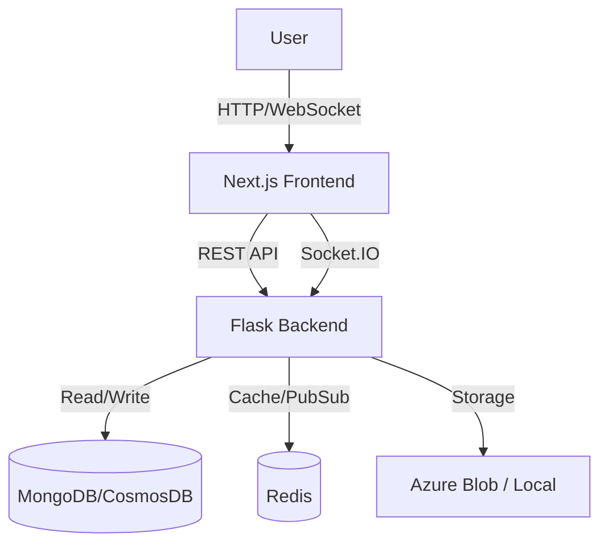

# Welcome to TopicsFlow Wiki

TopicsFlow is a real-time chat and topic discussion platform designed to facilitate focused conversations and community interactions.

## 📚 Documentation Index

- **[Getting Started](Getting-Started)**: Setup guide for developers and users.
- **[Project Structure](Project-Structure)**: Overview of the codebase layout.
- **[Backend Architecture](Backend-Architecture)**: Details on the Flask backend, API, and services.
- **[Frontend Architecture](Frontend-Architecture)**: Guide to the Next.js frontend application.
- **[Database Schema](Database-Schema)**: Comprehensive documentation of MongoDB models.
- **[API Reference](API-Reference)**: Key API endpoints and Socket.IO events.
- **[Deployment & DevOps](Deployment-and-DevOps)**: Instructions for deploying to Azure and using Docker.

## 🏗️ High-Level Architecture

## 🚀 Key Features

- **Real-time Chat**: Instant messaging in topics and private groups.
- **Topic Management**: Create and manage discussion topics with granular permissions.
- **Media Support**: Share images, videos, and files.
- **Role-Based Access**: Granular permissions for Owners, Moderators, and Members.
- **Moderation Tools**: Reporting, banning, and content filtering.
- **Secure Authentication**: Passwordless login, TOTP support, and secure session management.
